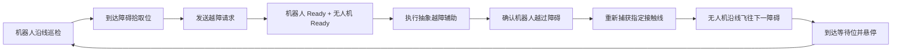
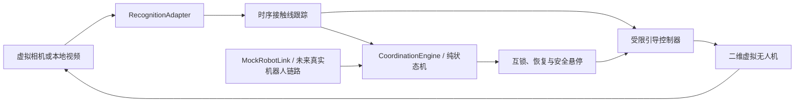

# RailDrone Mission Studio

面向“接触网巡检机器人 + 协同无人机”的本地任务规划、视觉验证与协同越障 Demo。

本项目验证的目标流程是：巡检机器人负责沿接触网线路移动和缺陷检测；当机器人遇到无法自行通过的障碍时，无人机执行抽象的越障辅助，确认机器人恢复后重新锁定指定接触线，自主飞往下一障碍点等待。

## 在线体验

| 部署环境 | 主工作区 | 接触线识别 | 协同闭环 |
| --- | --- | --- | --- |
| GitHub Pages | [打开任务编辑器](https://1379475267-svg.github.io/rail-drone-mission-studio/) | [打开识别工作区](https://1379475267-svg.github.io/rail-drone-mission-studio/#/recognition) | [打开协同闭环](https://1379475267-svg.github.io/rail-drone-mission-studio/#/coordination) |
| 阿里云 | [打开任务编辑器](http://fhrzz.me/projects/rail-drone-mission-studio/) | [打开识别工作区](http://fhrzz.me/projects/rail-drone-mission-studio/#/recognition) | [打开协同闭环](http://fhrzz.me/projects/rail-drone-mission-studio/#/coordination) |

两个入口均部署自公开仓库的 `main` 分支。阿里云版本挂载在个人站点的独立 `/projects/rail-drone-mission-studio/` 路径下，不替换站点主页；服务器当前沿用 HTTP，请勿在该入口处理敏感或未脱敏素材。

> [!IMPORTANT]
> 当前仓库是浏览器端的软件原型，不连接真实无人机、机器人或飞控。接触线识别采用确定性的图像边缘启发式基线，越障机构采用模拟适配器，二维闭环不代表真实飞行验证。请勿把本项目输出直接用于带电线路作业或真实飞行控制。

## 项目价值

RailDrone Mission Studio 把最终系统中原本分散的三类问题放在一个可运行、可复现的前端工作台中：

- 用航点编辑器表达任务意图并验证基础路线流程；
- 用本地图片或视频检查接触线候选提取、人工复核和数据导出流程；
- 用事件驱动状态机验证机器人请求、双端互锁、越障辅助、重新捕获线路、沿线前飞和到点等待的完整协同循环；
- 在接入 ROS、PX4 或真实机械机构之前，先暴露协议、状态、安全优先级和异常恢复上的设计问题。

项目重点不是替代巡检机器人的缺陷检测，而是验证无人机如何安全地完成“接力越障 + 沿线先行”。

## 三个工作区

| 工作区 | 路由 | 当前能力 | 主要输出 |
| --- | --- | --- | --- |
| 航点任务编辑 | `/` | 添加、选择、拖动和编辑无人机航点；路线插值仿真；本地保存与项目导入导出 | 任务 JSON、仿真状态与日志 |
| 接触线识别与复核 | `/recognition` | 本地图片/MP4 当前帧采样；候选折线提取；控制点编辑；接受/驳回与撤销 | schema `1.0` 标注 JSON、原尺寸标注 PNG |
| 机器人—无人机协同闭环 | `/coordination` | 虚拟反馈闭环、视频影子跟踪、三障碍协同循环、安全互锁与故障注入 | 协同状态、协议审计、跟踪/引导结果和运行快照 |

三个工作区相互独立：任务编辑器不会自动把像素折线转换成真实航迹，识别结果也不会直接发送给协同状态机或飞控。

## 协同流程

标准场景包含一架无人机、一台巡检机器人、一条指定接触线和 O1/O2/O3 三个预设障碍。每个障碍都配置了拾取、释放和等待站位。



核心阶段包括：

```text
WAITING_FOR_ROBOT
→ ASSIST_REQUESTED
→ ASSIST_PREPARING
→ ASSIST_EXECUTING
→ VERIFYING_ROBOT_CLEAR
→ ACQUIRING_LINE
→ FOLLOWING_LINE
→ APPROACHING_NEXT_OBSTACLE
→ WAITING_FOR_ROBOT
```

线路不稳定时进入 `LINE_RECOVERY`，通信、越障或感知安全条件不满足时进入 `SAFE_HOLD`；人工急停会进入 `ABORTED`。

### 消息与互锁

协同状态机使用 `rail-coop/1` 信封：

```ts
interface CoopMessage {
  protocol: 'rail-coop/1'
  missionId: string
  cycleId: string
  obstacleId: string
  seq: number
  sentAt: number
  source: 'ROBOT' | 'DRONE' | 'COORDINATOR'
  type: string
  payload: object
}
```

`missionId / cycleId / obstacleId` 必须与当前任务一致，`source + seq` 必须单调递增。错误、过期或重复消息会被拒绝并进入审计记录，不会重复触发越障动作。只有机器人和无人机都确认 Ready，状态机才允许进入越障执行阶段。

### 两种运行模式

**虚拟闭环**

虚拟无人机的横向位置和航向会改变下一帧合成接触线观测；跟踪器重新计算误差，引导控制器再改变虚拟无人机状态，因此形成可观察的软件反馈闭环。

**视频影子**

浏览器连续处理本地 MP4 的最新解码帧，输出跟踪状态和受限控制建议。建议不会改变已经录制的视频，也不会发送给真实设备，因此它是影子运行，不是真实闭环。

## 快速启动

### 环境要求

- Node.js 20.19+ 或兼容 Vite 7 的更新版本
- npm
- 支持现代 Canvas、SVG、`requestAnimationFrame` 的浏览器
- 视频影子模式建议使用浏览器可解码的 H.264 MP4

### 安装与运行

```bash
# 按锁文件安装依赖
npm ci

# 启动开发服务器
npm run dev
```

按终端打印的地址打开应用。开发服务器配置为监听 `0.0.0.0`，可能同时提供局域网地址；只应在可信网络中运行。

常用命令：

```bash
# Vue / TypeScript 类型检查
npm run type-check

# 运行确定性单元测试
npm test

# 类型检查并构建到 dist/
npm run build

# 预览生产构建
npm run preview
```

### 推荐体验顺序

1. 打开 `/coordination`，保留“虚拟闭环”，点击“启动”。
2. 观察机器人在 O1 发起请求、双端 Ready、越障、重新捕获线路，以及无人机前往 O2 等待。
3. 分别注入线路丢失、机器人通信中断和越障失败，检查 `LINE_RECOVERY`、`SAFE_HOLD` 和重新互锁。
4. 切换到“视频影子”，选择本地 MP4，观察连续跟踪与建议指令；该模式不会控制视频或设备。
5. 打开 `/recognition` 载入示例，体验候选线人工校正、审核和 JSON/PNG 导出。
6. 返回 `/`，导入 [任务规划示例](public/examples/rail-drone-demo.json) 或自行创建航点并运行路线仿真。

接触线示例素材位于 [public/examples/contact-line-demo.svg](public/examples/contact-line-demo.svg)。

## 各工作区能力

### 1. 航点任务编辑

- 连续添加、选择、拖动、删除和属性编辑无人机航点；
- 按显式 `order` 绘制有向路线；
- 基于二维距离、`pixelsPerMeter` 和航点速度进行线性插值仿真；
- 开始、暂停、继续、重置，以及 `0.5x / 1x / 2x / 4x` 倍速；
- localStorage 自动保存、手动保存、刷新恢复和项目 JSON 导入导出；
- 基础格式、数值范围、ID、顺序和关联引用校验。

当前任务编辑器以无人机航点为重点。支柱、接触线、障碍、禁飞区等完整场景绘制，以及真实可飞性校验尚未完成。

### 2. 接触线识别与复核

- 本地载入 PNG、JPEG、WebP 和 MP4，不上传媒体；
- 对图片或视频当前帧执行浏览器边缘连续性基线识别；
- 媒体与 SVG 标注共享原始像素坐标系；
- 拖动与键盘微调控制点、线段插点、新建人工线、删除/拆分线段；
- 接受、驳回、人工修改后回到待复核，以及 20 步撤销；
- 导出包含适配器、参数、审核和处理指标的 schema `1.0` JSON；
- 按原媒体尺寸合成标注 PNG。

上传限制为图片 40 MB、MP4 500 MB、解码媒体 4000 万像素；标注 PNG 导出上限为 2400 万像素。限制用于保护浏览器内存，不是业务验收指标。

### 3. 协同闭环

- 事件驱动、可确定性重放的纯状态转换；
- O1/O2/O3 拾取、释放和等待站位；
- 双端 Ready 互锁和协议幂等拒绝；
- 连续 3 帧确认、稳定 `trackId`、EMA 平滑、跳变门控和短遮挡预测；
- 约 0.5 秒持续丢线后停止前进，多候选歧义与过期结果禁止前进；
- 置信度、横向误差、航向误差和曲率联合限速；
- 二维一阶虚拟无人机动力学；
- 视频处理繁忙时只保留最新帧，避免形成延迟队列；
- 线路丢失、通信中断、越障失败、编号不匹配和人工急停故障注入；
- 场景、状态、协议消息、事件、跟踪和引导结果 JSON 快照导出。

越障动作只表达“准备、执行、释放、确认、失败”等协议语义，不假定实际使用吊运、托举、牵引或其他机械方案。

## 技术栈

| 层次 | 技术 |
| --- | --- |
| 前端 | Vue 3、Composition API、`<script setup lang="ts">` |
| 工程 | TypeScript、Vite |
| 状态与路由 | Pinia、Vue Router |
| UI | Element Plus、本地设计 token |
| 可视化 | SVG、Canvas、原始像素坐标标注 |
| 感知基线 | 浏览器灰度/边缘处理、连续路径搜索、时序折线跟踪 |
| 协同与控制 | 纯状态机、协议消息、受限引导、二维虚拟动力学 |
| 测试 | Vitest、`vue-tsc` |
| 存储 | localStorage、JSON 文件 |

项目没有后端服务，运行时不依赖远程字体、模型或 CDN。

## 架构

```text
rail-drone-mission-studio/
├─ public/examples/                  # 本地演示素材
├─ src/
│  ├─ components/
│  │  ├─ canvas/                     # 航点与路线 SVG 图层
│  │  ├─ layout/                     # 任务编辑器布局
│  │  ├─ recognition/                # 识别、标注与复核组件
│  │  └─ coordination/               # 感知、协同地图、状态与故障组件
│  ├─ data/                          # 默认任务和协同场景
│  ├─ services/
│  │  ├─ recognition/                # 帧采样、适配器与导出
│  │  ├─ tracking/                   # 时序跟踪与最新帧循环
│  │  ├─ guidance/                   # 引导控制与虚拟无人机
│  │  └─ coordination/               # 纯状态机、引擎与机器人模拟链路
│  ├─ stores/                        # 六个 Pinia store
│  ├─ types/                         # TypeScript 数据契约
│  ├─ views/                         # 三个工作区
│  └─ router/
├─ tests/                            # 协同、跟踪与引导测试
├─ package.json
└─ vite.config.ts
```

协同工作区的核心数据流：



主要扩展边界：

- [`RecognitionAdapter`](src/services/recognition/recognitionAdapter.ts)：替换浏览器启发式算法，可接本地 ONNX、Python 服务或 ROS 节点；
- [`WireTrackFrame`](src/types/tracking.ts)：统一连续跟踪结果；
- [`CoordinationEngine`](src/services/coordination/coordinationEngine.ts)：不依赖 Vue 组件，可接收跟踪事件和协议消息；
- [`coordinationStateMachine.ts`](src/services/coordination/coordinationStateMachine.ts)：纯状态转换与安全互锁；
- [`coordinationStore.ts`](src/stores/coordinationStore.ts)：负责页面时钟、暂停、单步、故障和快照；
- 模拟越障适配器：未来由确定后的机械接口实现替换。

## 测试与验证

自动测试位于：

- [`tests/coordinationEngine.test.ts`](tests/coordinationEngine.test.ts)
- [`tests/trackingGuidance.test.ts`](tests/trackingGuidance.test.ts)

当前测试集包含 2 个测试文件、9 项测试，覆盖：

- O1/O2/O3 完整协同循环和机器人进度单调性；
- 丢线 0.5 秒安全悬停与连续 3 帧重新捕获；
- 沿线飞行中的通信中断与恢复；
- 低置信度、过大误差和曲率的前进抑制；
- 越障失败后重新互锁；
- 障碍编号不匹配的消息拒绝与审计；
- 短遮挡预测、多候选歧义停止；
- 虚拟闭环的横向和航向误差收敛。

本地验证命令：

```bash
npm run type-check
npm test
npm run build
```

上述测试验证的是确定性软件逻辑，不包含真实浏览器编解码矩阵、ROS 集成、硬件在环、飞控安全或现场作业验收。媒体兼容性和响应式界面仍需在目标浏览器上检查。

## Demo 边界

| 当前可以证明 | 当前不能证明 |
| --- | --- |
| 协同协议和状态流可闭合 | 无人机已经能在真实接触网自主飞行 |
| 双端 Ready 与消息幂等逻辑可执行 | 真实机器人越障机构已经可用 |
| 虚拟二维反馈能够收敛 | PX4 动力学、风扰和载荷下仍能稳定 |
| 视频可连续输出影子控制建议 | 录制视频构成真实控制闭环 |
| 人工可以复核和导出像素折线 | 启发式结果达到工程识别精度 |
| 预设障碍流程可重复测试 | 系统能够发现未知障碍并生成安全站位 |

具体限制：

- `BrowserEdgeAdapter` 只寻找高对比连续边缘，不理解“接触线”语义，也可能跟踪天空、建筑、轨道或其他线状结构；
- 当前没有接触网专项训练模型、独立验证集或召回率、中心线误差、连续跟踪率等工程指标；
- 识别工作区处理选定的图片或视频当前帧；连续视频跟踪只在协同工作区的影子模式中演示；
- 单目二维折线不能给出线路真实三维坐标、带电安全间距或可靠高度；
- 标注像素坐标不能直接转换为 ENU/NED 航迹，仍需相机标定、位姿估计和坐标变换；
- 协同障碍来自预配置场景，没有未知障碍检测、真实避障规划或自动安全站位生成；
- 虚拟动力学不包含 PX4、加速度、姿态、风场、悬挂载荷、碰撞、传感器噪声和真实通信延迟；
- 越障机构尚未确定，模拟成功只表示软件协议完成；
- MP4 是否可用取决于浏览器和文件内部编码，项目不会转码；
- 航点编辑器的 X/Y 是演示画布坐标，不是经纬度或实测局部坐标；
- 当前没有多机调度、后端数据库、账号权限、跨设备同步或工业级任务版本迁移。

## 真实系统接入路线

建议按“先影子、后约束闭环；先地面和硬件在环、后现场”的顺序推进。

### 1. 明确机械与安全接口

- 确定越障方式、载荷、对接、释放和失败回退策略；
- 定义机器人与无人机的 Ready 条件、位置容差、超时、重试和人工接管流程；
- 固化控制优先级：

```text
人工接管 / 急停
> 避障与安全边界
> 定位或通信故障
> 接触线跟随
> 普通任务推进
```

### 2. 建立接触线数据与模型

- 采集不同光照、背景、曲率、遮挡和多线场景；
- 标注指定接触线的中心线、可见区间和目标身份；
- 训练分割、关键点或折线模型，并在独立线路上评估；
- 明确中心线误差、丢失恢复时间、错误换线率、端到端延迟和最低处理频率。

### 3. 从二维像素恢复可控几何

- 完成相机内外参标定和时间同步；
- 融合无人机位姿、激光雷达或双目/深度信息；
- 把像素折线转换为带坐标系和时间戳的三维目标；
- 独立计算带电安全距离，不能用单目像素宽度替代。

### 4. ROS 影子接入

- 将相机、定位、避障和机器人链路接入适配层；
- 先只记录并对比“建议轨迹”和“实际轨迹”，不发送控制指令；
- 使用 rosbag/日志复现丢线、延迟、断链和错误目标场景；
- 将运行时遥测与任务 JSON 分开，避免把高频点云或图像写入 Pinia。

### 5. 规划与飞控闭环

- 视觉模块输出目标线、前视点、置信度和时效，不直接承担飞行安全；
- 将目标交给局部规划器，由避障、安全距离和飞控约束共同生成轨迹；
- 在飞控侧保留限高、禁飞区、电量、链路、速度、姿态和人工确认保护；
- 任何结果过期、目标歧义、线路丢失或通信中断都必须抑制前进并进入安全策略。

### 6. 硬件在环与分级现场试验

- 先仿真与回放，再硬件在环；
- 先无载、低速、非带电和有保护的试验环境，再逐步扩大包线；
- 对越障机构、载荷摆动、避障优先级、失联、急停和人工接管做独立验收；
- 由具备资质的团队完成法规、铁路运营、电气和现场安全审查。

## 数据、隐私与仓库范围

- 图片和视频默认只在当前浏览器中解码和处理，不上传到服务器；
- 航点项目保存在当前来源的 localStorage，清理站点数据、隐私模式或切换域名/端口都可能导致数据丢失；
- 重要任务、标注和协同记录应主动导出 JSON；
- 本仓库只包含网页 Demo，不包含原始无人机大容量备份、设备密码、真实飞控参数、ROS bag 或训练模型权重；
- 不要把设备凭证、现场数据或未经脱敏的控制参数提交到公开仓库。

## 免责声明

RailDrone Mission Studio 仅用于软件设计、交互演示、算法基线研究和协议验证。它不是飞控软件、铁路作业系统、接触网安全检测设备或经过认证的自主飞行产品。

接触网和铁路现场存在高电压、列车运行、通信干扰、复杂气流和机械失效等重大风险。任何真实设备接入、飞行、越障或带电线路试验，都必须由具备相应资质的组织完成独立的机械、电气、飞控、网络安全、法规和现场风险评估，并配置硬件急停、人工接管和可靠的安全冗余。

**不要把浏览器中的候选折线、虚拟控制建议或模拟越障结果直接发送给真实飞控或作业设备。**
